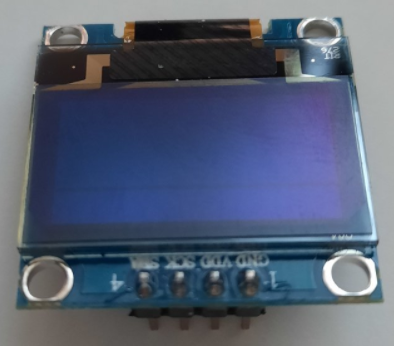
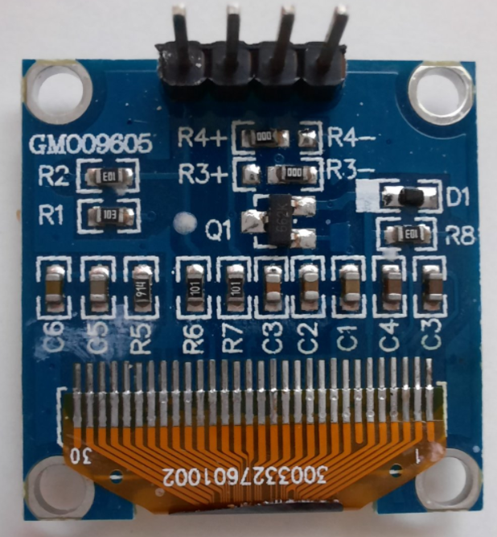

#  OLEDisplay

Control Node for I2C OLED 128x64 Graphic Display with SSD1306 driver.  
Behaves like a 20 characters x 4 lines, Character-LCD.

 *  Category: Display
 *  HAL: mbed
 *  Tested: with LPC1768 and GM009605 display
 *  Authors: N. Chalikias, F. Cosentino

  
 
## Input data types
*  (Schematic pin 1):  Pointer to string
  
## Input
*  (Schematic pin 1):  Pointer to string

## Parameters:

 *  PinName: pinSDA for I2C
 *  PinName: pinSCL for I2C
 *  PinName: pinRST Reset signal for the board

## Example:
[Ticker]-->[Counter]-->[StringFormat]-->[OLEDisplay]

